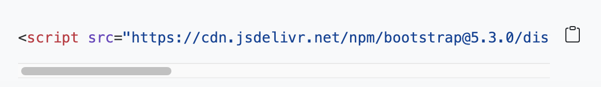
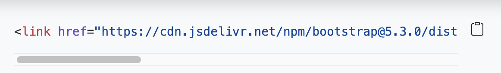

# UX and Advanced HTML & CSS : Portfolio with Bootstrap 5.3

## DESCRIPTION
Simple, elegant and creative portfolio template for showcase portfolio or personal information. It is responsive website template created with Bootstrap 5.3. Clean source code and well organized files for easy to customization. This template hope gives a personal space to share what you are all about as a creative designer, developer, photographer or pretty much any profession!

## Most important features :

    1. Fully responsive
    2. Easy installation
    3. Easy to use and customize
    4. Simple and elegant

## INSTRUCTION 

Using Bootstrap, recreate a portfolio site with the following items:

* A navigation bar

* A navigation menu at the top. Feel free to use the navbar code provided in Bootstrap's documentation, or create your own navbar by applying the correct Bootstrap classes to your HTML.

    - Include links that are applicable to your portfolio.

    - Links should navigate to the appropriate sections

* A hero section

    - A jumbotron featuring your picture, your name, and any other information you'd like to include.

* A work section

    - A section displaying work in grid.

    - If you need to use placeholder image use placehold.coLinks to an external site.

    - Use Bootstrap cards for each project.

    - The description should give a brief overview of the work.

    - Each project will eventually link to your class project work!

* A skills section

    - List out the skills you expect to learn from the bootcamp.
An about/contact section

An About Me section in the same row.
* A footer section

All hyperlinks should have a hover effect.

All buttons should display a box shadow upon hover.

## Useful Links :
Bootstrap 5.3 : https://getbootstrap.com/

Introduction bootstrap : https://getbootstrap.com/docs/5.3/getting-started/introduction/

Font Awesome : https://fontawesome.com/

Javascripst : 
    

CSS Bootstrap :
    

## OUTCOME

Deploy the link portfolio project [Git Hub]( )

## LICENSE

MIT

## Contact
Email : noeamelyaofficial@hotmail.com

Instagram : https://www.instagram.com/noe_amelya/

Facebook : https://www.facebook.com/model.noeamelya/

Twitter : https://www.twitter.com/noeamelya

GitHub : https://github.com/noeamelya

